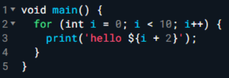
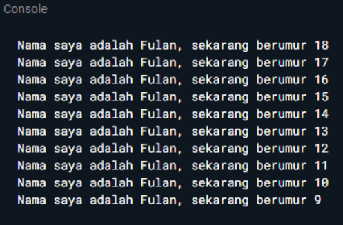
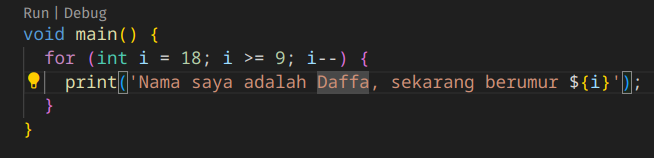
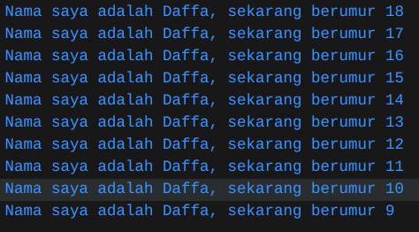

### Nama : Daffa Maulana Satria
### NIM : 2241720105
### Kelas : TI-3D 
<br>

## PERTEMUAN 2

1. Modifikasilah kode pada baris 3 di VS Code atau Editor Code favorit Anda berikut ini agar mendapatkan keluaran (output) sesuai yang diminta!
   
   

   Output yang diminta:

   

    Hasil:

   
   
   


2. Mengapa sangat penting untuk memahami bahasa pemrograman Dart sebelum kita menggunakan framework Flutter ? Jelaskan!
    ```
    Memahami bahasa pemrograman Dart sangat penting sebelum menggunakan Flutter karena Flutter sepenuhnya menggunakan Dart untuk menulis UI dan logika aplikasi. Dengan menguasai Dart, kita akan lebih mudah memahami sintaks dan struktur kode yang dibutuhkan untuk membuat aplikasi di Flutter. Konsep pemrograman berorientasi objek (OOP) seperti kelas dan objek juga sangat penting, terutama karena Flutter memanfaatkan konsep ini untuk membuat dan mengelola widget.

    Selain itu, Dart mendukung pemrograman asinkron, yang sangat berguna ketika kita perlu melakukan operasi seperti pengambilan data dari internet secara bersamaan tanpa menghentikan aplikasi. Memahami Dart juga membantu kita memanfaatkan fitur penting Flutter, seperti hot reload, dengan lebih efektif, sehingga kita bisa melihat perubahan secara langsung tanpa perlu merestart aplikasi. Pengelolaan state (status aplikasi) dalam Flutter, seperti penggunaan metode setState(), juga bergantung pada pemahaman kita tentang Dart.
    ```

3. Rangkumlah materi dari codelab ini menjadi poin-poin penting yang dapat Anda gunakan untuk membantu proses pengembangan aplikasi mobile menggunakan framework Flutter.
    ```
    Bahasa Dart adalah inti dari framework Flutter. Kerangka kerja modern seperti Flutter membutuhkan bahasa modern tingkat tinggi agar bisa memberikan pengalaman terbaik kepada pengembang, serta memungkinkan untuk membuat aplikasi seluler yang luar biasa. Memahami Dart adalah dasar untuk bekerja dengan Flutter; pengembang perlu mengetahui asal-usul bahasa Dart, bagaimana komunitas mengerjakannya, kelebihannya, dan mengapa itu adalah bahasa pemrograman yang dipilih untuk Flutter.

    A. Fitur Dart
        a. Productive tooling
        b. Garbage collection
        c. Type annotations 
        d. Statically typed
        e. Portability

    B. Evolusi Dart
        a. Diluncurkan pada tahun 2011. Lalu pada tahun 2013 dirilis versi stabilnya.
        b. Tujuan awal dari dart untuk menggantikan bahasa JavaScript.
        c. Menawarkan performa terbaik dan alat yang lebih baik untuk proyek berskala besar
        d. Dibentuk agar kuat dan fleksibel dan penambahan OOP

    C. Bagaimana Dart Bekerja?
        Dart adalah bahasa pemrograman yang mendukung berbagai jenis aplikasi, dari web hingga mobile. Ia bekerja dengan mengubah kode Dart menjadi kode native untuk aplikasi mobile atau JavaScript untuk aplikasi web. Dart memiliki dua cara kompilasi: JIT untuk pengembangan cepat dan AOT untuk performa tinggi saat aplikasi siap digunakan. Dart juga menyediakan alat modern dan fitur seperti keamanan null untuk membantu pengembang membuat aplikasi yang efisien dan berkinerja baik.

    D. Struktur Dart 
        Jika pengguna sudah mengetahui beberapa bahasa pemrograman seperti bahasa C atau memiliki beberapa pengalaman dengan JavaScript, sebagian besar sintaks Dart akan lebih mudah bagi pengguna untuk memahaminya. Dart menyediakan sebagian besar operator standar untuk memanipulasi variabel; built-in types adalah yang paling umum ditemukan dalam bahasa pemrograman tingkat tinggi. Control flow dan function sangat mirip dengan bahasa pemrograman lainnya.
    ```