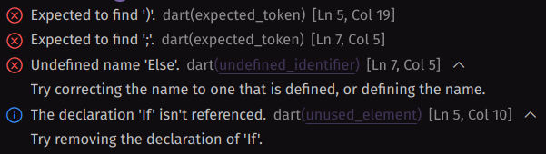
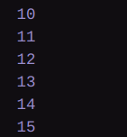

### Nama : Daffa Maulana Satria
### NIM : 2241720105
### Kelas : TI-3D
<br>

# PERTEMUAN 3
## Praktikum 1
### Langkah 1
```
void main() {
  String test = "test2";
  if (test == "test1") {
    print("Test1");
  } else If (test == "test2") {
    print("Test2");
  } Else {
    print("Something else");
  }

  if (test == "test2") print("Test2 again");
}
```


### Langkah 2
 <br>

Terdapat kesalahan pada penulisan kata "else if" dan "else". Pada baris berikut:
1. else If (test == "test2") seharusnya ditulis : else if.
2. Else { seharusnya ditulis : else.

### Langkah 3
```
  String test = "true";
  if (test) {
    print("Kebenaran");
  }
```
 <br>

Perbaikan semua kode :
```
void main() {
  String test = "test2";
  if (test == "test1") {
    print("Test1");
  } else if (test == "test2") {
    print("Test2");
  } else {
    print("Something else");
  }

  if (test == "test2") print("Test2 again");

  String test2 = "true";
  if (test2 == "true") {
    print("Kebenaran");
  }
}
```


## Praktikum 2
### Langkah 1
```
void main() {
  while (counter < 33) {
  print(counter);
  counter++;
  }  
}
```
### Langkah 2
 <br>
Perbaikan error dan penjelesan

```
void main() {
  int counter = 0;
  while (counter < 33) {
  print(counter);
  counter++;
  }  
}
```

Sebelumnya error karena variable counter belum dideklarasi dan inisiasi, perbaikan dilakukan dengan mendeklarasi variable counter dan inisiasi dengan angka 0
<br>

Hasil <br>


### Langkah 3
```
do {
  print(counter);
  counter++;
} while (counter < 77);
``` 
 <br>

Perbaikan dan penjelesan
```
void main() {
    int counter = 0;
    
  do {
    print(counter);
    counter++;
  } while (counter < 77);
}
```
 <br>

Sebelumnya error karena lagi lagi variable counter tidak di deklarasi dan inisiasi, perbaikan dilakukan dengan mendklarasi varaible counter dan inisisasi yaitu 0.

## Praktikum 3
### Langkah 1
```
void main() {
  for (Index = 10; index < 27; index) {
  print(Index);
  }
}
```

### Langkah 2
 <br>
Penjelasan error dan perbaikan 
```
void main() {
  for (int index = 10; index < 27; index++) {
    print(index);
  }
}
```



Sebelumnya terdapat error dimana nama variable untuk inisiasi index = 10 menggunakan kapital "Index" dan variable index terakhir tidak ada ++ jadi loop tidak akan jalan, perbaikan dilakukan dengan memberikan lower case pada nama variable pertama dan memberikan ++ pada vraible index terakhir.

## Tugas
```
void main() {
  bool isPrime(int number) {
    if (number < 2) {
      return false;
    }
    for (int i = 2; i * i <= number; i++) {
      if (number % i == 0) {
        return false;
      }
    }
    return true;
  }

  for (int i = 0; i <= 201; i++) {
    if (isPrime(i)) {
      print('\n$i adalah bilangan prima');
      print('Nama: Daffa Maulana Satria');
      print('NIM: 2241720105');
    }
  }
}
```


