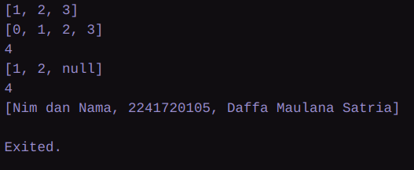

### Nama : Daffa Maulana Satria
### NIM : 2241720105
### Kelas : TI-3D
<br>

# PERTEMUAN 4
## Praktikum 1
### Langkah 1
```dart
void main() {
  var list = [1, 2, 3];
  assert(list.length == 3);
  assert(list[1] == 2);
  print(list.length);
  print(list[1]);

  list[1] = 1;
  assert(list[1] == 1);
  print(list[1]);
}
```

### Langkah 2


Disin kita membuat list dengan isi 1, 2, 3, lalu "assert" digunakan untuk mengecek suatu kondisi, jika kondisi false maka program akan error berhenti.kode "list.length" digunakan untuk mengetahui panjang array dan kode "list[1] = 1;" digunakan untuk mengubah nilai ke 2 di dalam list menjadi 1.

### Langkah 3
```dart
  final List<dynamic> list = List.filled(5, null);

  list[1] = "Daffa Maulana Satria";
  list[2] = 2241720105;

  print(list);
```
 <br>

## Praktikum 2
### Langkah 1
```dart
  var halogens = {'fluorine', 'chlorine', 'bromine', 'iodine', 'astatine'};
  print(halogens);
```
### Langkah 2


kode di atas yaitu "halogen" merupakan sebuah set (kumpulan data unik yang tidak mempunyai urutan pasti)

### Langkah 3
```dart
  var names1 = <String>{};
  Set<String> names2 = {}; // This works, too.
  var names3 = {}; // Creates a map, not a set.

  print(names1);
  print(names2);
  print(names3);
```
<br>

Perbaikan:
```dart
  var names1 = <String>{};
  Set<String> names2 = {}; // This works, too.
  // var names3 = {}; // Creates a map, not a set.

  names1.add('Daffa Maulana Satria');
  names1.add('2241010105');

  names2.addAll(['Daffa Maulana Satria', '2241010105']);

  print(names1);
  print(names2);
```
<br>
Kode di atas sebenarnya sama saja, tetapi jika menggunakan .addAll() maka kita bisa menggunakan array untuk memasukkan beberapa data sekaligus.

## Praktikum 3
### Langkah 1

```dart
var gifts = {
  // Key:    Value
  'first': 'partridge',
  'second': 'turtledoves',
  'fifth': 1
  };

  var nobleGases = {
    2: 'helium',
    10: 'neon',
    18: 2,
  };

  print(gifts);
  print(nobleGases);
```

### Langkah 2

"map" adalah adalah jenis koleksi yang menyimpan pasangan key-value (kunci-nilai), di mana setiap key unik, dan masing-masing key memetakan satu value.

### langkah 3
```dart
  var mhs1 = Map<String, String>();
  gifts['first'] = 'partridge';
  gifts['second'] = 'turtledoves';
  gifts['fifth'] = 'golden rings';

  var mhs2 = Map<int, String>();
  nobleGases[2] = 'helium';
  nobleGases[10] = 'neon';
  nobleGases[18] = 'argon';

  gifts['2241720105'] = 'Daffa Maulana Satria';
  nobleGases[2241720105] = "Daffa Maulana Satria";
  mhs1["2241720105"] = "Daffa Maulana Satria";
  mhs2[2241720105] = "Daffa Maulana Satria";

  print(gifts);
  print(nobleGases);
  print(mhs1);
  print(mhs2);
```

 
## Praktikum 4
### Langkah 1
```dart
  var list = [1, 2, 3];
  var list2 = [0, ...list];
  print(list1);
  print(list2);
  print(list2.length);
```
### Langkah 2
Perbaikan dan penjelasan:
```dart
  var list = [1, 2, 3];
  var list2 = [0, ...list];
  print(list);
  print(list2);
  print(list2.length);
```


penggunaan "...list" ini berarti memasukkan data dari list dan menyesuakan panjang array list2 ditambah list pertama

### Langkah 3
```dart
  list1 = [1, 2, null];
  print(list1);
  var list3 = [0, ...?list1];
  print(list3.length);
```
perbaikan :
```dart
  var list = <int?>[1, 2, 3];
  var list2 = [0, ...list];
  print(list);
  print(list2);
  print(list2.length);

  list = [1, 2, null];
  print(list);
  var list3 = [0, ...list];
  print(list3.length);

  var id = ["2241720105", "Daffa Maulana Satria"];
  var desc = ["Nim dan Nama", ...id];

  print(desc);
```


### Langkah 4
```dart
  var nav = ['Home', 'Furniture', 'Plants', if (promoActive) 'Outlet'];
  print(nav);
```

Perbaikan dan penjelesan :
```dart
  var promoActive = true;
  var nav = ['Home', 'Furniture', 'Plants', if (promoActive) 'Outlet'];
  print(nav);
```
 <br>
Jika "promoActive" tidak dideklarasi maka akan error

### Langkah 5
```dart
  var nav2 = ['Home', 'Furniture', 'Plants', if (login case 'Manager') 'Inventory'];
  print(nav2);
```

Perbaikan:
```dart
  String login = "Manager";
  var nav2 = ['Home', 'Furniture', 'Plants', if (login case 'Manager') 'Inventory'];
  print(nav2);

  login = "User";
  nav2 = ['Home', 'Furniture', 'Plants', if (login case 'Manager') 'Inventory'];
  print(nav2);
```
 <br>
Perbaikan dilakukan dengan cara mendeklarasikan variable 'login'

### Langkah 6
```dart
  var listOfInts = [1, 2, 3];
  var listOfStrings = ['#0', for (var i in listOfInts) '#$i'];
  assert(listOfStrings[1] == '#1');
  print(listOfStrings);
```
 <br>
Tidak terjadi error, Collection "for" berguna untuk menghasilkan data yang dinamis langsung di dalam Collection (list, map, set, dsb.)

## Praktikum 5
### Langkah 1
```dart
  var record = ('first', a: 2, b: true, 'last');
  print(record)
```
### Langkah 2


### Langkah 3
```dart
  (int, int) tukar((int, int) record) {
    var (a, b) = record;
    return (b, a);
  }
```
Perbaikan:
```dart
void main() {
  var record = ('first', a: 2, b: true, 'last');
  print(record);

  var records = (1,2);
  print("Nilai a : " + records.$1.toString());
  print("Nilai b : " + records.$2.toString());
  print("-------------------------------------------------------");

  records = tukar(records);

  print("Nilai a : " + records.$1.toString());
  print("Nilai b : " + records.$2.toString());
}

(int, int) tukar((int, int) record) {
  var (a, b) = record;
  return (b, a);
}
```


### Langkah 4
```dart
  // Record type annotation in a variable declaration:
  (String, int) mahasiswa;
  print(mahasiswa);
```
perbaikan :
```dart
  void main() {
    (String, int) mahasiswa = ("Fahridana Ahmad Rayyansyah", 2241720158);
    print(mahasiswa);
  }

  (int, int) tukar((int, int) record) {
    var (a, b) = record;
    return (b, a);
  }
```


### Langkah 5
```dart
var mahasiswa2 = ('first', a: 2, b: true, 'last');

print(mahasiswa2.$1); // Prints 'first'
print(mahasiswa2.a); // Prints 2
print(mahasiswa2.b); // Prints true
print(mahasiswa2.$2); // Prints 'last'
```
Perbaikan :
```dart
  var mahasiswa2 = ('2241720158: Daffa Maulana Satria', a: 2, b: true, 'last');

  print(mahasiswa2.$1); // Prints 'first'
  print(mahasiswa2.a); // Prints 2
  print(mahasiswa2.b); // Prints true
  print(mahasiswa2.$2); // Prints 'last'
```


## Tugas Praktikum
2. Jelaskan yang dimaksud Functions dalam bahasa Dart! <br/>
**Jawab**
    > Function adalah sebuah blok kode yang dapat dipanggil dan dieksekusi ketika dipanggil
3. Jelaskan jenis-jenis parameter di Functions beserta contoh sintaksnya!<br/>
**Jawab**
    > Dart mendukung beberapa jenis parameter dalam fungsi, yaitu:
    >
    > **Positional Parameter:** Parameter biasa yang harus diberikan nilainya secara berurutan.
    > ```dart
    > void greet(String firstName, String lastName) {
    >   print('Hello, $firstName $lastName');
    > }
    > greet('John', 'Doe'); // Output: Hello, John Doe
    > ```
    >
    > **Optional Positional Parameter:** Parameter yang tidak wajib diberikan nilai, dan jika tidak disediakan, akan bernilai null atau memiliki nilai default.
    > ```dart
    > void greet(String firstName, [String? lastName]) {
    >   print('Hello, $firstName ${lastName ?? ''}');
    > }
    > greet('John'); // Output: Hello, John
    > greet('John', 'Doe'); // Output: Hello, John Doe
    > ```
    >
    > **Named Parameter:** Parameter yang harus diberi nama saat dipanggil. Bisa bersifat opsional dengan nilai default atau tidak wajib diberikan.
    > ```dart
    > void greet({required String firstName, required String lastName}) {
    >   print('Hello, $firstName $lastName');
    > }
    > greet(firstName: 'John', lastName: 'Doe'); // Output: Hello, John Doe
    > ```
    >
    > **Optional Named Parameter:** Sama dengan named parameter, namun bersifat opsional.
    > ```dart
    > void greet({String firstName = 'John', String lastName = 'Doe'}) {
    >   print('Hello, $firstName $lastName');
    > }
    > greet(); // Output: Hello, John Doe
    > greet(firstName: 'Jane'); // Output: Hello, Jane Doe
    > greet(lastName: 'Smith'); // Output: Hello, John Smith
    > ```
4. Jelaskan maksud Functions sebagai first-class objects beserta contoh sintaknya! <br/>
**Jawab**
    > Fungsi bisa disimpan dalam variabel, dipassing sebagai argumen, dan dikembalikan dari fungsi lain.
    >
    > ```dart
    > void sayHello() {
    >   print("Hello!");
    > }
    >
    > void main() {
    >   // Simpan fungsi dalam variabel
    >   var func = sayHello;
    >
    >   // Panggil fungsi dari variabel
    >   func(); // Output: Hello!
    >
    >   // Passing fungsi sebagai parameter
    >   executeFunction(func);
    > }
    >
    > void executeFunction(void Function() func) {
    >   func(); // Output: Hello!
    > }
    > ```

5. Apa itu Anonymous Functions? Jelaskan dan berikan contohnya!<br/>
**Jawab**
  > Anonymous Functions adalah fungsi yang tidak memiliki nama.
  >
  > ```dart
  > void main() {
  >   var list = ['Apple', 'Banana', 'Cherry'];
  >
  >   list.forEach((item) {
  >     print(item); // output: Apple, Banana, Cherry
  >   });
  > }
  > ```

6. Jelaskan perbedaan Lexical scope dan Lexical closures! Berikan contohnya!<br/>
**Jawab**
> **Lexical Scope** adalah aturan yang menentukan di mana variabel dapat diakses berdasarkan di mana variabel tersebut dideklarasikan dalam kode sumber. Dalam Dart, variabel yang dideklarasikan dalam suatu blok kode hanya dapat diakses dalam blok tersebut dan blok-blok yang bersarang di dalamnya.
>
> **Contoh Lexical Scope:**
> ```dart
> void main() {
>   var outerVariable = 'I am outside!';
>
>   void innerFunction() {
>     var innerVariable = 'I am inside!';
>     print(outerVariable); // Bisa mengakses outerVariable
>     print(innerVariable); // Bisa mengakses innerVariable
>   }
>
>   innerFunction();
>   // print(innerVariable); // Error: Tidak bisa mengakses innerVariable
> }
> ```
>
> **Lexical Closures** adalah fungsi yang "menutup" variabel dari lingkup luar di mana fungsi tersebut didefinisikan. Ini memungkinkan fungsi untuk mengingat dan mengakses variabel dari lingkup luar bahkan setelah lingkup tersebut selesai dieksekusi.
>
> **Contoh Lexical Closures:**
> ```dart
> void main() {
>   var outerVariable = 'I am outside!';
>
>   Function createInnerFunction() {
>     var innerVariable = 'I am inside!';
>     return () {
>       print(outerVariable); // Bisa mengakses outerVariable
>       print(innerVariable); // Bisa mengakses innerVariable
>     };
>   }
>
>   var innerFunction = createInnerFunction();
>   innerFunction(); // Memanggil innerFunction yang merupakan closure
> }
> ```

7. Jelaskan dengan contoh cara membuat return multiple value di Functions!<br/>
**Jawab**
> Mengembalikan beberapa nilai dari sebuah fungsi dengan menggunakan `Record`. Berikut adalah contohnya:
>
> ```dart
> // Fungsi yang mengembalikan beberapa nilai
> (int, String) getUserInfo() {
>   int id = 101;
>   String name = "John Doe";
>   return (id, name);
> }
>
> void main() {
>   var userInfo = getUserInfo();
>   print("ID: ${userInfo.$1}");
>   print("Name: ${userInfo.$2}");
> }
> ```
>
> Pada contoh di atas, fungsi `getUserInfo` mengembalikan dua nilai: `id` dan `name`. Nilai-nilai tersebut dikemas dalam sebuah `Record` dan dapat diakses menggunakan properti `$1`, `$2`, dan seterusnya.
